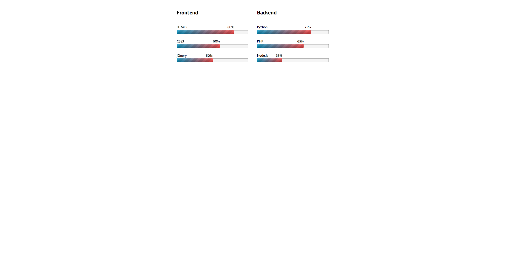

# Django - 0 - Initiation

> Any extra file need for exercises are in __d00__ folder

## Exercice 00: First shell script

First shell script (ex00/myawesomescript.sh): write an executable /bin/sh script using only curl, grep, cut that prints the real URL behind a bit.ly link

| Example of use| Expected answer |
| --- | --- |
| `./myawesomescript.sh bit.ly/1O72s3U` |  `http://42.fr/` |

## Exercice 01: Your resume in HTML

Resume in HTML (ex01/cv.html): create semantic HTML/CSS resume including title tag and h1, a table with visible collapsed borders (lowest-right cell border color #424242), both ul and ol lists; use different styling methods (style tag and style attribute).

## Exercice 02: Email sending form

Email sending form (ex02/form.html): create an HTML5 contact form with firstname, name, age (number), phone (tel), email (email), student checkbox, gender radio buttons, and a submit button whose onclick is displayFormContents(); integrate provided popup.js (must not be modified) so a popup shows form contents.

## Exercice 03: Web page replicating

Replicate this web page in HTML5 using the supplied CSS without modifying it; separate style and content and respect semantics.:

## Exercice 04: Snippets JS integration.

Snippets JS integration (ex04/snippets.html): import four provided JS files (file1.js–file4.js) so a popup appears correctly; you may not modify or add JavaScript in the HTML and must not change the provided scripts.

## Exercice 05: W3C validation

Use [W3C validation!](http://validator.w3.org/) to crrect `index.html` provided in __d00__  folder .
