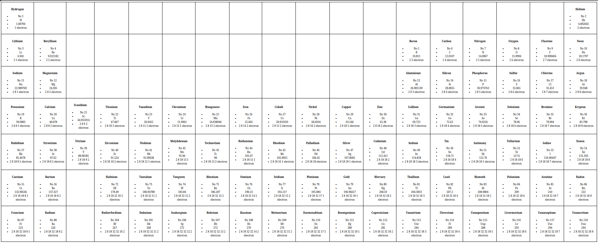

#  Django - 0 - Starting

> Many exercises require copying provided dictionaries/lists unchanged.
> Several scripts must accept exactly one command-line parameter and use specific messages/behavior on errors.

## Exercise 00 — my first variables (ex00/var.py)

Create a function my_var that declares 9 variables of different types and prints each value with its Python type.

Required output shows examples for int, str, float, bool, list, dict, tuple, set.

Call function under `if name == '__main__'`.

## Exercise 01 — Numbers (ex01/numbers.py)

Read numbers.txt (numbers 1–100 separated by commas) and print each number on its own line (no commas).

Any function structure allowed.

## Exercise 02 — My first dictionary (ex02/var_to_dict.py)

Given a list of (name, year) pairs (musicians and birth years), convert it to a dictionary where year is the key and name is the value.

Print the dictionary in the format "YEAR : Name" (order may vary).

## Exercise 03 — Key search (ex03/capital_city.py)

Copy provided states and capital_cities dictionaries unchanged.
Program takes exactly one argument: a state name and prints its capital; if not found print "Unknown state".

If argument count ≠ 1, do nothing. import sys allowed.

## Exercise 04 — Search by value (ex04/state.py)

Using the same dictionaries, take a capital city as argument and print the corresponding state.

Same argument-count behavior and error messages as Exercise 03. import sys allowed.

## Exercise 05 — Search by key or value (ex05/all_in.py)

Copy dictionaries unchanged.

Program takes a single string argument containing comma-separated expressions.

For each expression determine whether it is a state, a capital, or neither (case-insensitive, ignore extra spaces).

Handle consecutive commas (empty items) by doing nothing; if overall argument count ≠1 do nothing.

Output lines like "Trenton is the capital of New Jersey" or "toto is neither a capital city nor a state".

## Exercise 06 — Dictionary sorting (ex06/my_sort.py)

Given a dictionary mapping musician name → year, display musician names sorted by year ascending; for identical years sort names alphabetically.

Print one name per line (do not show years).

## Exercise 07: Periodic table of the elements

A 'periodic_table.txt' file is provided for this exercise

Generate a HTML file to reproduce the Mendeleiev’s Table  as it appears on Google. 

- Each element must be in a ’box’ of a HTML table.
- The name of an element must be in a level 4 title tag.
- The attributes of an element must appear as a list. The lists must state at least the atomic numbers, the symbol and the atomic mass.

