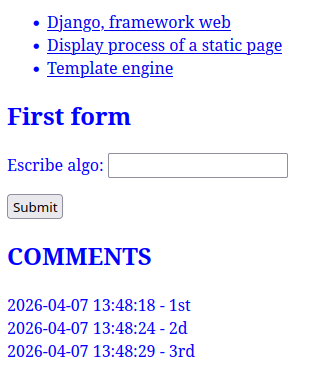
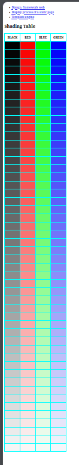

# Django - 1 - Base Django

Each exercise must be in its own app folder and include requirements.txt plus project files. Use Django features freely. Follow DRY with a base template and include nav.html.

## Ex00 — First static page

- Create virtualenv, install Django, produce requirements.txt.
- Start project d05 and app ex00.
- Create index.html template for a page titled "Ex00: Markdown Cheatsheet" that documents Markdown syntax.

- Use :
    - venv activation : `. ./myscript.sh`
    - now in __django_venv__ :
        - ```
            cd django
            python3 manage.py runserver
            ```
    - In browser  [http://localhost:8000/ex00](http://localhost:8000/ex00)

### Tips

#### `django/d05/`

-  In `django/d05/urls.py`
```python
...
urlpatterns = [
    path("ex00/", include("ex00.urls")),
    path('admin/', admin.site.urls),
]
...
```
-  In `django/d05/settings.py`
```python
...
INSTALLED_APPS = [
...
    'ex00',
...
```

#### `django/ex00/`

- In `django/ex00/urls.py`
```python
...
urlpatterns = [
    path("", views.index),
]
...
```
- In `django/ex00/views.py`
```python
from django.shortcuts import render

def index(request):
    return render(request, 'ex00/index.html')
```

- In `django/ex00/templates`  put your `ex00/index.html`

## Ex01 — A few more pages

- Create app ex01 with pages:
    - /ex01/django — "Ex01: Django, framework web." Brief intro and history.
    - /ex01/display — "Ex01: Display process of a static page." Explain request→view→template→response flow.
    - /ex01/templates — "Ex01: Template engine." Explain Django template engine: blocks, for loops, ifs, and displaying context variables.
- Use base.html with blocks: content, style, title. Include nav.html in all pages.
- Provide two CSS files: style1.css (blue text) used by default, and style2.css (red text) used only on the Template engine page by overriding the style block. Each stylesheet must be used exactly once.

- Use :
    - venv activation : `. ./myscript.sh`
    - now in __django_venv__ :
        - ```
            cd django
            python3 manage.py runserver
             ```
    - In browser:
        - [http://localhost:8000/ex01/django](http://localhost:8000/django)
        - [http://localhost:8000/ex01/display/](http://localhost:8000/ex01/display/)
        - [http://localhost:8000/ex01/templates/](http://localhost:8000/ex01/templates/)

### Tips

#### `django/d05/`

-  In `django/d05/urls.py`
```python
...
urlpatterns = [
    path("ex00/", include("ex00.urls")),
    path('admin/', admin.site.urls),
]
...
```
-  In `django/d05/settings.py` add  `ex01` and `templates` folder name. Where contains : `base.html` and `nav.html` 
```python
...
INSTALLED_APPS = [
...
    'ex00',
    'ex01',
...
TEMPLATES = [
    {
        ...
        #'DIRS': [],
        'DIRS': [BASE_DIR / 'templates'],
        ...
```

#### `django/ex01/`

- In `django/ex01/urls.py`
```python
...
urlpatterns = [
    path("django/", views.django_view, name="django-view"),
    path("display/", views.display_view, name="display-view"),
    path("templates/", views.templates_view, name="templates-view"),
]
...
```

- In `django/ex01/views.py`  
```python
from django.shortcuts import render

def django_view(request):
    return render(request, 'ex01/django.html')

def display_view(request):
    return render(request, 'ex01/display.html')

def templates_view(request):
    return render(request, 'ex01/templates.html')
```

- In `django/ex01/templates`  put your `ex01/django.html`, `ex01/display.html` and `ex01/templates.html`

## Ex02 — First form

- Create app ex02 with a page containing:
    - A Django form (django.forms.Form) with a text field and submit button (do not hard-code the field in template).
    - An input history section.
- For each submission: append the input with timestamp to a logs file (auto-create if missing) stored in the ex02 folder; add the entry (with timestamp) to the page history. Path to the log file must be set in settings.py.
- Data omust persist across server restarts (i.e., read from the log file so redisplayed pages show saved history).

- Use :
    - venv activation : `. ./myscript.sh`
    - now in __django_venv__ :
        - ```
            cd django
            python3 manage.py runserver
            ```
    - In browser  [http://localhost:8000/ex02](http://localhost:8000/ex02)



### Tips

#### `django/d05/`

-  In `django/d05/urls.py`
```python
...
urlpatterns = [
    ...
    path("ex02/", include("ex02.urls")),
    path('admin/', admin.site.urls),
]
...
```
-  In `django/d05/settings.py` add  `ex02` , `templates` folder name and `HISTORY_LOG_FILE` to know the path for log file. 
```python
...
INSTALLED_APPS = [
...
    'ex00',
    'ex01',
    'ex02',
...
TEMPLATES = [
    {
        ...
        #'DIRS': [],
        'DIRS': [BASE_DIR / 'templates'],
        ...
...

# File to store history for ex02
HISTORY_LOG_FILE = BASE_DIR / 'history.log'
```

#### `django/ex02/`

- In `django/ex02/urls.py`
```python
from django.urls import path
from . import views

app_name = 'ex02'

urlpatterns = [
    path("", views.form_view, name='form-view'),
]
```

- In `django/ex02/views.py` . Here the code for use wit form  `def form_view(request)`. Important import Object `MessageForm` with `from .forms import MessageForm`

- In `django/ex02/templates`  put your `ex02/index.html`. Here Html and django code for __form__ (where [csrf_token](https://docs.djangoproject.com/en/6.0/ref/csrf/)  and [{{ form.as_p }}](https://www.geeksforgeeks.org/python/form-as_p-render-django-forms-as-paragraph/)):

```python
...
        <form method="post">
            
            {{ form.as_p }}
            <button type="submit">Submit</button>
        </form>
...
```
- In `django/ex02/views.py` define `form_view(request)` function that returns form object (with empty values) and `historic` variable to use in `index.html`  

## Ex03 — Fifty shades of bic

- Create app ex03 and display a table 4 columns × 51 rows (one header row + 50 shade rows). Columns: noir, rouge, bleu, vert.
- Each cell: 40px height × 80px width, background a generated shade matching its column; generate shades in the view (do not hard-code colors). All shades must be different.
- Template constraints: only 4 and 4 tag pairs allowed; use one per column header, one per shade row, one per color box.

- Use :
    - venv activation : `. ./myscript.sh`
    - now in __django_venv__ :
        - ```
            cd django
            python3 manage.py runserver
             ```
    - In browser  [http://localhost:8000/ex03](http://localhost:8000/ex03)



### Tips

Similar tips as ex00, ex01 and ex02 exercises

- In `django/ex03/views.py` define `table_view(request)` function that returns `colors_table` in list format to use in `index.html`  


