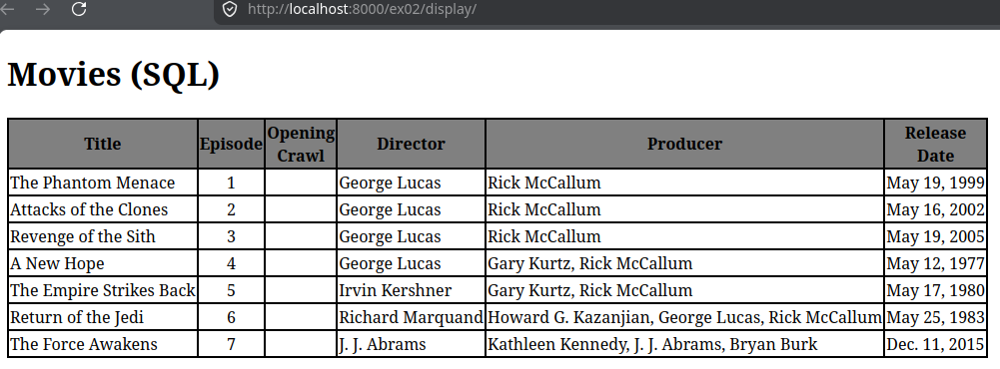
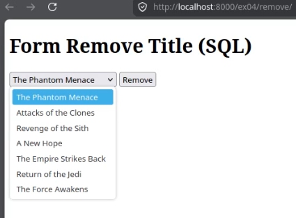
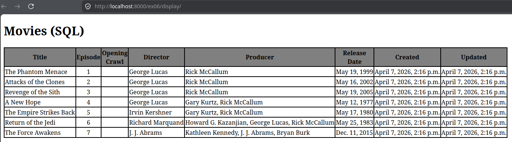
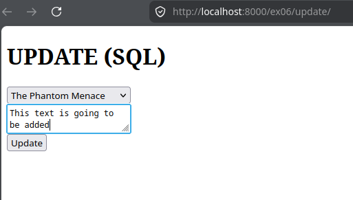
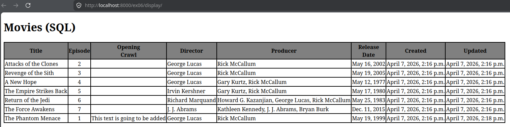
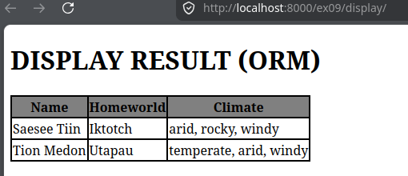
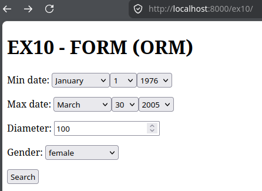
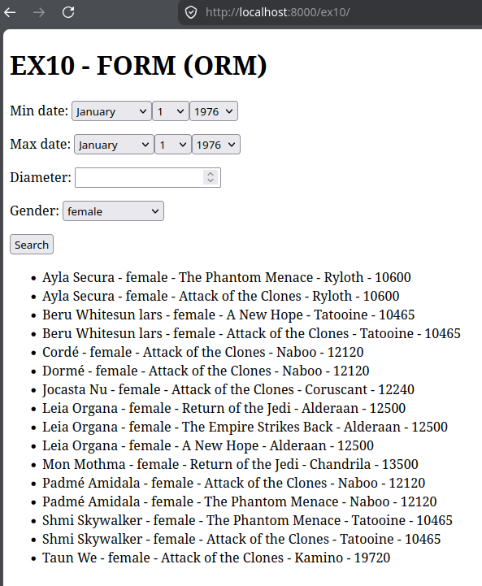

#  Django - 2 - SQL

Django training exercises focused on SQL and ORM tasks using PostgreSQL. Each exercise requires creating a Django app with specific views, models, and routes to create, populate, display, and delete items in tables.


## PostgreSQL in Docker container 

PostgreSQL v15 is used under Docker container. (docker_compose.yml must be used for test propopuse. DON'T USE IN PRODUCTION)

Use container with name `postgres_django`:

- Set up :  `docker compose up`
- Acces to  `postgres_django`  container via CLI : `docker exec -it postgres_django /bin/bash`
- If you are in  `postgres_django`  container CLI, you can interact with PosgreSQL using __psql__.
    - Acces to __psql__ : `psql -U djangouser -d djangotraining`
        - __\dt__ : List tables
        - __\d TableName__ : Show info about _Table_name_
- Set down postgres container deleting volumes:  `docker compose down -v`

Some usefull docker commands:

- Delete no used volumes by any container : `docker volume prune`
- Delete all containers that are running now : `docker rm -f $(docker ps -aq)

## Exercice 00: SQL - building a table

- Table/model fields (exact specifications):
    -   title: VARCHAR(64), unique, NOT NULL
    -   episode_nb: integer, PRIMARY KEY
    -   opening_crawl: TEXT, nullable
    -   director: VARCHAR(32), NOT NULL
    -   producer: VARCHAR(128), NOT NULL
    -   release_date: DATE, NOT NULL

- create ex00_movies via psycopg2 at /ex00/init, return "OK" or error.


Steps to run this ecercise :

- Run django server in venv:

```bash
. ./myscript.sh
python manage.py run server
```

- Create table in Postgres with  : [http://localhost:8000/ex00/init](http://localhost:8000/ex00/init)
- Acces to PostgreSQL container via CLI and use __psql__ and check the created table.

Steps to stop this exercise:

- Stop server  `Ctrl+C`
- Stop venv with `deactivate`


## Exercise 01: ORM - building a table

> replicate Table/model from ex00 in ORM.

- create app ex01 with Movies model matching the fields and str returning title.

Steps to run this exercise :
- Activate venv with : `. ./myscript.sh`
- Generate table migration : `python manage.py makemigrations`
- Make migration : `python manage.py migrate`
- Run django server : `python manage.py run server`
- Acces to PostgreSQL container via CLI and use __psql__ and check the created table.

Steps to stop this exercise:

- Stop server  `Ctrl+C`
- Stop venv with `deactivate`

## Exercise 02: SQL - Data insertion

- app ex02 with:
    - /ex02/init: create ex02_movies
    - /ex02/populate: insert seven specified Star Wars films (details given)
    - /ex02/display: show table data in HTML or "No data available"

Steps to run this exercise :
- Activate venv with : `. ./myscript.sh`
- Run django server : `python manage.py run server`
- Acces to app via browser with :
    - Create table in Postgres  : [http://localhost:8000/ex02/init](http://localhost:8000/ex02/init)
    - Populate data in table : [http://localhost:8000/ex02/populate](http://localhost:8000/ex02/populate)
    - Display table content : [http://localhost:8000/ex02/display](http://localhost:8000/ex02/display)

Steps to stop this exercise:

- Stop server  `Ctrl+C`
- Stop venv with `deactivate`



## Exercice 03: ORM - data insertion

- app ex03 with Movies model and:
    - /ex03/populate: insert same seven films via ORM, return "OK" per insert
    - /ex03/display: show data or "No data available" (migrations run during evaluation)

Steps to run this exercise :
- Activate venv with : `. ./myscript.sh`
- Generate table migration : `python manage.py makemigrations`
- Make migration : `python manage.py migrate`
- Run django server : `python manage.py run server`
- Acces to app via browser with :
    - Create table in Postgres  : [http://localhost:8000/ex03/init](http://localhost:8000/ex03/init)
    - Populate data in table : [http://localhost:8000/ex03/populate](http://localhost:8000/ex03/populate)
    - Display table content : [http://localhost:8000/ex03/display](http://localhost:8000/ex03/display)

Steps to stop this exercise:

- Stop server  `Ctrl+C`
- Stop venv with `deactivate`

## Exercise 04: SQL - Data deleting
- app ex04 with:
    - /ex04/init: create ex04_movies
    - /ex04/populate: insert same seven films (reinsert deleted)
    - /ex04/display: show data or "No data available"
    - /ex04/remove: HTML form to select and delete a film, then redisplay updated list

Steps to run this exercise :
- Activate venv with : `. ./myscript.sh`
- Run django server : `python manage.py run server`
- Acces to app via browser with :
    - Create table in Postgres  : [http://localhost:8000/ex04/init](http://localhost:8000/ex04/init)
    - Populate data in table : [http://localhost:8000/ex04/populate](http://localhost:8000/ex04/populate)
    - Display table content : [http://localhost:8000/ex04/display](http://localhost:8000/ex04/display)
    - Remove any content in  table : [http://localhost:8000/ex04/remove](http://localhost:8000/ex04/remove)

Steps to stop this exercise:

- Stop server  `Ctrl+C`
- Stop venv with `deactivate`



## Exercice 05: ORM - Deleting data

- Model: same as ex01 Movies.
- /ex05/populate: insert data from ex03; reinsert deleted records; return "OK" per successful insert or an error message.
- /ex05/display: show all Movies rows in an HTML table (include empty fields) or display "No data available" if none/error.
- /ex05/remove: form with dropdown of film titles and a submit button named remove; on submit delete selected film and redisplay updated form; if no data/error show "No data available".
- Note: migrations run before tests.

Steps to run this exercise :
- Activate venv with : `. ./myscript.sh`
- Generate table migration : `python manage.py makemigrations`
- Make migration : `python manage.py migrate`
- Run django server : `python manage.py run server`
- Acces to app via browser with :
    - Populate data in table : [http://localhost:8000/ex05/populate](http://localhost:8000/ex05/populate)
    - Display table content : [http://localhost:8000/ex05/display](http://localhost:8000/ex05/display)
    - Remove any content in  table : [http://localhost:8000/ex05/remove](http://localhost:8000/ex05/remove)

Steps to stop this exercise:

- Stop server  `Ctrl+C`
- Stop venv with `deactivate`

## Exercise 06: SQL - Updating a data

- /ex06/init: create ex06_movies table (same as ex00 specs) plus:
    - created: datetime set on insert,
    - updated: datetime set on insert and updated automatically via a trigger function that sets NEW.updated = now() and preserves created.
- /ex06/populate: insert same films as ex02; show "OK" per insert or error.
- /ex06/display: show all ex06_movies in an HTML table or "No data available".
- /ex06/update: form to select a film and provide text; on submit replace the selected film’s opening_crawl with the provided text; if no data/error show "No data available".

Steps to run this exercise :
- Activate venv with : `. ./myscript.sh`
- Run django server : `python manage.py run server`
- Acces to app via browser with :
    - Create table in Postgres  : [http://localhost:8000/ex06/init](http://localhost:8000/ex06/init)
    - Populate data in table : [http://localhost:8000/ex06/populate](http://localhost:8000/ex06/populate)
    - Display table content : [http://localhost:8000/ex06/display](http://localhost:8000/ex06/display)
    - Update any content in  table : [http://localhost:8000/ex06/update](http://localhost:8000/ex06/update)

Steps to stop this exercise:

- Stop server  `Ctrl+C`
- Stop venv with `deactivate`


__Table before update__



__Form to update a tittle__



__Table after update a tittle__




## Exercise 07: ORM - Updating a data

- Model: same as ex01 with added created and updated datetime fields (created set on insert; updated set on insert and auto-updated on change).
- /ex07/populate: populate with same data as ex02; return "OK" per insert or error.
- /ex07/display: show all Movies in HTML table or "No data available".
- /ex07/update: form to select a film and enter text; on submit update opening_crawl for the chosen film; if no data/error show "No data available".
- Note: migrations run before tests.

Steps to run this exercise :
- Activate venv with : `. ./myscript.sh`
- Generate table migration : `python manage.py makemigrations`
- Make migration : `python manage.py migrate`
- Run django server : `python manage.py run server`
- Acces to app via browser with :
    - Populate data in table : [http://localhost:8000/ex07/populate](http://localhost:8000/ex07/populate)
    - Display table content : [http://localhost:8000/ex07/display](http://localhost:8000/ex07/display)
    - Update any content in  table : [http://localhost:8000/ex07/update](http://localhost:8000/ex07/update)

Steps to stop this exercise:

- Stop server  `Ctrl+C`
- Stop venv with `deactivate`

## Exercise 08: SQL - Foreign Key

- /ex08/init: create two tables:
    - ex08_planets: id (serial PK), name (VARCHAR(64) UNIQUE NOT NULL), climate, diameter, orbital_period, population (bigint), rotation_period, surface_water (real), terrain (VARCHAR(128)).
    - ex08_people: id (serial PK), name (VARCHAR(64) UNIQUE NOT NULL), birth_year (VARCHAR(32)), gender, eye_color, hair_color (all VARCHAR(32)), height (integer), mass (real), homeworld (VARCHAR(64)) — foreign key referencing ex08_planets.name.
- /ex08/populate: import people.csv → ex08_people and planets.csv → ex08_planets; return "OK" per successful insertion or error (hint: look into psycopg2.copy_from).
- /ex08/display: list characters’ names, their homeworld, and climate (filter climates "windy" or "moderately windy") sorted by character name alphabetically; if none/error show "No data available".

Steps to run this exercise :
- Activate venv with : `. ./myscript.sh`
- Run django server : `python manage.py run server`
- Acces to app via browser with :
    - Create table in Postgres  : [http://localhost:8000/ex08/init](http://localhost:8000/ex08/init)
    - Populate data in table : [http://localhost:8000/ex08/populate](http://localhost:8000/ex08/populate)
    - Display table content : [http://localhost:8000/ex08/display](http://localhost:8000/ex08/display)

Steps to stop this exercise:

- Stop server  `Ctrl+C`
- Stop venv with `deactivate`

## Exercise 09: ORM - Foreign Key

- Create app ex09 with two models:
    - Planets: fields — name (unique, varchar(64), not null), climate, diameter (int), orbital_period (int), population (bigint), rotation_period (int), surface_water (real), terrain, created (datetime auto-set on create), updated (datetime auto-set on create and auto-updated). str returns name.
    - People: fields — name (varchar(64), not null), birth_year (varchar(32)), gender (varchar(32)), eye_color (varchar(32)), hair_color (varchar(32)), height (int), mass (real), homeworld (varchar(64)) as a foreign key referencing Planets.name, created and updated datetimes (same auto behaviors). str returns name.
- Add view at /ex09/display that shows all characters’ names, their homeworld and climate when the planet climate is "windy" or "moderately windy", sorted alphabetically by character name, in an HTML table.
- If no data, display: "No data available, please use the following command line before use:" plus the command to load ex09_initial_data.json from the repo root.
- Provide the fixture file; migrations will run before tests.

Steps to run this exercise :
- Activate venv with : `. ./myscript.sh`
- Generate table migration : `python manage.py makemigrations`
- Make migration : `python manage.py migrate`
- Load data in table : `pyhton manage.py loaddata ex09_initial_data.json`
- Run django server : `python manage.py run server`
- Acces to app via browser with :
    - Display table content : [http://localhost:8000/ex09/display](http://localhost:8000/ex09/display)

Steps to stop this exercise:

- Stop server  `Ctrl+C`
- Stop venv with `deactivate`



## Exercise 10: ORM - Many to Many

- Create app ex10 with three models:
    - Planets and People: identical to ex09.
    - Movies: same as ex01 plus a many-to-many field characters linking to People.
- Include fixtures in ex10_initial_data.json.
- Add view at /ex10 showing a form with fields:
    - Movies minimum release date (date)
    - Movies maximum release date (date)
    - Planet diameter greater than (number)
    - Character gender (dropdown of distinct gender values from People)
- On submit, return characters whose gender matches the selected gender, who appear in films released between the given dates, and whose homeworld diameter >= given number. Display each result line with: character name, gender, film title, homeworld name, homeworld diameter. If no results show "Nothing corresponding to your research".
- Note: many-to-many relation requires intermediate table (handled by migrations).

> Tip. The data file used for generate values in tables has NULL values that are supposed not be NULL. So let created and updated to accept NULL values.


Steps to run this exercise :
- Activate venv with : `. ./myscript.sh`
- Generate table migration : `python manage.py makemigrations`
- Make migration : `python manage.py migrate`
- Load data in table : `pyhton manage.py loaddata ex10_initial_data.json`
- Run django server : `python manage.py run server`
- Acces to app via browser with :
    - Display table content : [http://localhost:8000/ex10](http://localhost:8000/ex10)

Steps to stop this exercise:

- Stop server `Ctrl+C`
- Stop venv with `deactivate`

### Tips for django forms

See `CharacterSearchForm(form.Form)` in `forms.py`

- [SelectDateWidget()](https://docs.djangoproject.com/en/6.0/ref/forms/widgets/) Lets  introduce a Date in similar way as `ChoiceField` but for year, month and day.
    - it's possible to define years range that appear in `SelectDateWidget` using `self.fields['min_date'].widget.years = years` , where years is a range list with valid years. To that ` Movies.objects.aggregate` is used .  `aggregate` let make calculation an return the result as dictionari with one value. The functions used are `Min` and `Max` for `release_data` and the resukt key are `release_data__min` for `Min('release_date') and `release_date__max for `Max('release_date__max')` functions.

- To get `gender` without repeat any:
    - Make a consult do BBDD to get all gender without repeats with :  `genders = People.objects.values_list('gender', flat=True).distinct()`
    - Add the genders list to `ChoiceField` with `self.fields['gender'].choices = [ (g, g) for g in genders if g ]`

__Form before search button is pressed__



__Form after search button is pressed__


